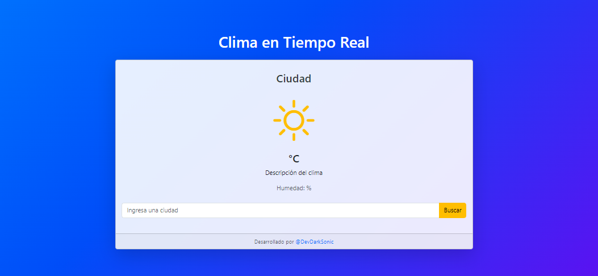

<div align="center">

# Climate Weather
</div>

### Descripción General.
**Climate Weather** es una aplicación web diseñada para proporcionar a los usuarios información meteorológica en tiempo real. La aplicación permite a los usuarios buscar el clima de cualquier ciudad ingresando su nombre y ofrece datos sobre temperatura, humedad y condiciones climáticas actuales, así como pronósticos para los próximos días. Con un diseño moderno y responsivo, la aplicación utiliza Bootstrap para una mejor usabilidad y accesibilidad.

[](https://miguel-antonio-martinez-jimenez.github.io/Climate_Weather/)

<div align="center">
   
   Puedes acceder a una vista previa de la aplicación aquí: [Climate Weather - Vista Previa](https://miguel-antonio-martinez-jimenez.github.io/Climate_Weather/)
</div>

## Objetivo.
El objetivo principal de **Climate Weather** es facilitar a los usuarios el acceso a información meteorológica precisa y actualizada, permitiéndoles planificar sus actividades diarias en función de las condiciones climáticas. La aplicación busca ser intuitiva y fácil de usar, asegurando que los usuarios puedan obtener datos de manera rápida y eficiente.

## Características Principales.
- **Búsqueda de Clima**: Permite a los usuarios buscar el clima de una ciudad ingresando su nombre en un campo de texto.
- **Datos Meteorológicos Actuales**: Muestra información actual como temperatura, humedad y descripción del clima.
- **Pronósticos Extendidos**: Proporciona pronósticos del clima para los próximos cinco días con detalles sobre temperaturas máximas y mínimas, así como condiciones climáticas.
- **Interfaz Visual**: Incluye íconos representativos del clima y un diseño atractivo basado en Bootstrap.
- **Manejo de Errores**: Presenta mensajes de error amigables si no se ingresa información o si se escribe incorrectamente el nombre de la ciudad.
- **Responsividad**: Se adapta a diferentes tamaños de pantalla, facilitando su uso en dispositivos móviles y de escritorio.

## Requisitos del Proyecto.
- **Tecnologías Utilizadas**:
  - HTML, CSS y JavaScript para la construcción de la interfaz de usuario.
  - Bootstrap para el diseño responsivo y estilización.
  - API de WeatherAPI para obtener datos climáticos.
- **Requisitos del Sistema**:
  - Navegador web moderno (Chrome, Firefox, Edge, etc.) para la visualización de la aplicación.
  - Conexión a Internet para acceder a la API y obtener datos meteorológicos.
- **Configuraciones Necesarias**:
  - Clave de API de WeatherAPI para realizar solicitudes de datos.
  - Archivos CSS y JavaScript organizados para un fácil mantenimiento y actualización de la aplicación.
> [!Important]
> Es importante asegurarse de que todos los requisitos estén instalados y configurados correctamente antes de ejecutar este proyecto para evitar problemas y asegurar un funcionamiento óptimo.

## Tecnologías Utilizadas.
- **HTML**: Para estructurar el contenido de la aplicación.
- **CSS**: Para el diseño y la presentación de la interfaz de usuario.
- **JavaScript**: Para la interactividad y la manipulación del DOM.
- **Bootstrap**: Para el diseño responsivo y componentes predefinidos que mejoran la usabilidad.
- **API de WeatherAPI**: Para obtener datos meteorológicos en tiempo real.

## Guía de Instalación.
1. Clonación del Repositorio: Clona el repositorio del proyecto desde GitHub o descarga el archivo ZIP.

   ```bash
   git clone https://github.com/Miguel-Antonio-Martinez-Jimenez/API-Clock.git
2. Accede a la carpeta del proyecto que has clonado.
3. Abre el archivo `index.html` en tu navegador web preferido.

## Configuración Inicial.
1. **Obtener la Clave de API**:
  - Regístrate en [WeatherAPI](https://www.weatherapi.com) y obtén tu clave de API.
2. **Configurar la Clave de API**:
  - Abre el archivo script.js y reemplaza la variable apiKey con tu clave de API obtenida.

## Conexión con la Base de Datos.
Este proyecto no requiere un sistema de gestión de bases de datos. En su lugar, se emplean archivos para el almacenamiento y manejo de los datos.

## Acceso o Credenciales.
El proyecto no requiere acceso o credenciales específicas, ya que es una aplicación de cliente sin autenticación de usuario.

## Guía de Uso del Proyecto.
1. Acceder a la Aplicación:
  - Abre el archivo index.html en tu navegador.
2. Buscar el Clima:
  - Escribe el nombre de una ciudad en el campo de entrada y haz clic en el botón "Buscar".
3. Ver Resultados:
  - La aplicación mostrará el clima actual, incluyendo temperatura, humedad y condiciones climáticas.
  - También mostrará el pronóstico del clima para los próximos cinco días.
4. Manejo de Errores:
  - Si no se ingresa un nombre de ciudad o si el nombre es incorrecto, aparecerá un mensaje de error.

## Estructura del Proyecto.
- Estructura del proyecto **Climate Weather**

  ```bash
  Climate_Weather/
  │
  ├── css/
  │   └── style.css
  ├── js/
  │   └── script.js
  ├── index.html
  ├── LICENSE
  └── README.md


## API.
- **WeatherAPI**: La aplicación utiliza la API de WeatherAPI para obtener datos meteorológicos en tiempo real. La API permite buscar información sobre el clima actual y el pronóstico a corto plazo.
- **Puntos de Endpoints**:
  - **Clima Actual**: http://api.weatherapi.com/v1/current.json?key=API_KEY&q=CITY&lang=es
  - **Pronóstico**: http://api.weatherapi.com/v1/forecast.json?key=API_KEY&q=CITY&days=5&lang=es
- **Autenticación**: Se requiere una clave de API para acceder a los datos.
**Ejemplo de Respuesta**:
  
  ```bash
  {
    "location":
    {
      "name": "Mexico City",
      "region": "The Federal District",
      "country": "Mexico",
      "lat": 19.43,
      "lon": -99.13,
      "tz_id": "America/Mexico_City",
      "localtime_epoch": 1727640251,
      "localtime": "2024-09-29 14:04"
    },
    "current":
    {
      "last_updated_epoch": 1727640000,
      "last_updated": "2024-09-29 14:00",
      "temp_c": 18.1,
      "temp_f": 64.6,
      "is_day": 1,
      "condition":
      {
        "text": "Cielo cubierto",
        "icon": "//cdn.weatherapi.com/weather/64x64/day/122.png",
        "code": 1009
      },
      "wind_mph": 5.4,
      "wind_kph": 8.6,
      "wind_degree": 10,
      "wind_dir": "N",
      "pressure_mb": 1023,
      "pressure_in": 30.22,
      "precip_mm": 0,
      "precip_in": 0,
      "humidity": 83,
      "cloud": 100,
      "feelslike_c": 18.1,
      "feelslike_f": 64.6,
      "windchill_c": 18.1,
      "windchill_f": 64.5,
      "heatindex_c": 18.1,
      "heatindex_f": 64.6,
      "dewpoint_c": 12.6,
      "dewpoint_f": 54.7,
      "vis_km": 8,
      "vis_miles": 4,
      "uv": 5,
      "gust_mph": 6.6,
      "gust_kph": 10.5
    }
  }

## Contribuciónes.
> [!Tip]
> Si deseas contribuir al proyecto, reportar errores o proponer mejoras, te invitamos a abrir un pull request o issue en el repositorio. También puedes contactarme directamente para compartir tus ideas o sugerencias a través de mi correo electrónico miguelantoniomartinezjimenez00@gmail.com. ¡Toda colaboración es bienvenida!

## Estado del Proyecto.
**Estado Actual:** `Finalizado`
> [!Note]
> Este proyecto se encuentra en estado **Finalizado**, lo que significa que todas las funcionalidades planeadas han sido implementadas y probadas satisfactoriamente. El código está disponible para su uso y estudio, y se aceptan contribuciones para mejoras o nuevas características.

## Testeo.
- **Pruebas de Funcionalidad**:
  - Verifica que al ingresar una ciudad válida, la aplicación muestre la información del clima correctamente.
  - Asegúrate de que los mensajes de error aparezcan cuando no se ingresa ninguna ciudad o se ingresa un nombre incorrecto.
- **Pruebas de Responsividad**:
  - Abre la aplicación en diferentes tamaños de pantalla para garantizar que se vea bien en dispositivos móviles y de escritorio.
- **Uso de Herramientas**: Puedes usar herramientas como Postman para probar los endpoints de la API y verificar las respuestas.

## Despliegue.
- **Plataformas de Despliegue**:
  - **GitHub Pages**: Puedes desplegar tu aplicación estática en GitHub Pages siguiendo las instrucciones en la documentación de GitHub.
  - **Netlify o Vercel**: Estas plataformas permiten desplegar aplicaciones web fácilmente al conectar tu repositorio de Git.
- **Pasos para Desplegar**:
1. Asegúrate de que tu código esté en un repositorio de Git.
2. Crea una cuenta en la plataforma de despliegue elegida.
3. Conecta tu repositorio y configura los ajustes de despliegue.
 
## Problemas Conocidos y Limitaciones.
- **Problemas Conocidos**:
  - La API puede tener tiempos de respuesta lentos durante picos de uso.
  - La aplicación puede no manejar correctamente ciertas entradas de ciudades no encontradas, lo que podría llevar a mensajes de error confusos.
- **Limitaciones**:
  - La API gratuita de WeatherAPI tiene un límite de solicitudes por minuto.
  - El pronóstico solo está disponible para los próximos cinco días.
  - La aplicación no tiene capacidades offline; se requiere una conexión a Internet para funcionar.

## Versiones.
- **Version Actual**: v1.7.

## Actualizaciones.
- **Versiones Futuras**: Se planean actualizaciones para mejorar la experiencia del usuario, como:
  - Integrar más información, como pronósticos a largo plazo o alertas meteorológicas.
  - Mejorar la gestión de errores para proporcionar mensajes más claros.
  - Añadir características como un historial de búsquedas o favoritos.
- **Control de Versiones**: Utiliza un sistema de control de versiones como Git para realizar un seguimiento de los cambios y las mejoras en el proyecto.

## Autores.
[MiguelMartinez30 - @DevDarkSonic](https://github.com/Miguel-Antonio-Martinez-Jimenez)

## Licencia.
Este proyecto está licenciado bajo la Licencia MIT. Consulta el archivo LICENSE para más detalles.
